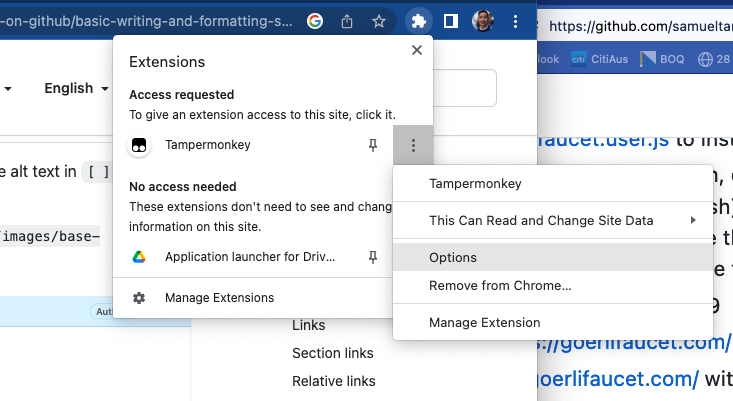

# geth-tampermonkey
Tampermonkey script to get Goerli Eth from faucet

## Prerequisites
This script assumes you have logged in to https://goerlifaucet.com/ 

## Installation

1. Install Tampermonkey via https://www.tampermonkey.net/ or Chrome extensions page
2. Navigate to this [script](goerli-faucet.user.js) to install
3. Open the TamperMonkey extension, click dashboard, edit the newly added script (icon on far-right next to trash)
   - In Chrome, click extensions
   - Select more options by clicking the three little dots next to TamperMonkey
   - Select Options
   - Click + in the top right to add a new script

  
  
4. Update your target wallet on line 19
5. Navigate to https://goerlifaucet.com/ 
6. Log into https://goerlifaucet.com/ with your wallet


## Automation setup
1. (If required) Setup bin and log directories
   - Create bin directory it by ```mkdir ~/.bin```
   - Create it by ```mkdir ~/.log```
2. Create automation script
   - Open Terminal
   - Navigate to .bin folder ```cd ~/.bin```
   - Type "vi automate_geth.sh". Press return
   - Press "i"
   - Copy and paste the script from [here](automate_geth.sh)
   - Press ESC
   - Type ":wq". Press return
2. Setup cronjob (Note. this will run the automate_geth.sh script daily at 0:0:0 UTC. If you want a different time of day adjust to your preferred settings https://crontab.guru/ can help. Also if you store your scripts in a different directory to ~/.bin you will need to modify the path that is referenced)
   - Open Terminal
   - Type "env editor=vi crontab -e". Press return
   - Press "i"
   - Copy and paste the script from [here](crontab.example)
   - Set the second 0 in the script to a time of day you expect your laptop to be on (0 = 00am UTC / 11am AEDT / 8pm EST)
   - Press ESC
   - Type ":wq". Press return

## Common Issues
1. You may get an "Operation not permitted" error when trying to run the automate_geth.sh script via crontab. Read [this article](https://osxdaily.com/2018/10/09/fix-operation-not-permitted-terminal-error-macos/) to fix this on macos


## Usage
1. Opon Chrome Browser
2. Navigate to https://goerlifaucet.com/ 
